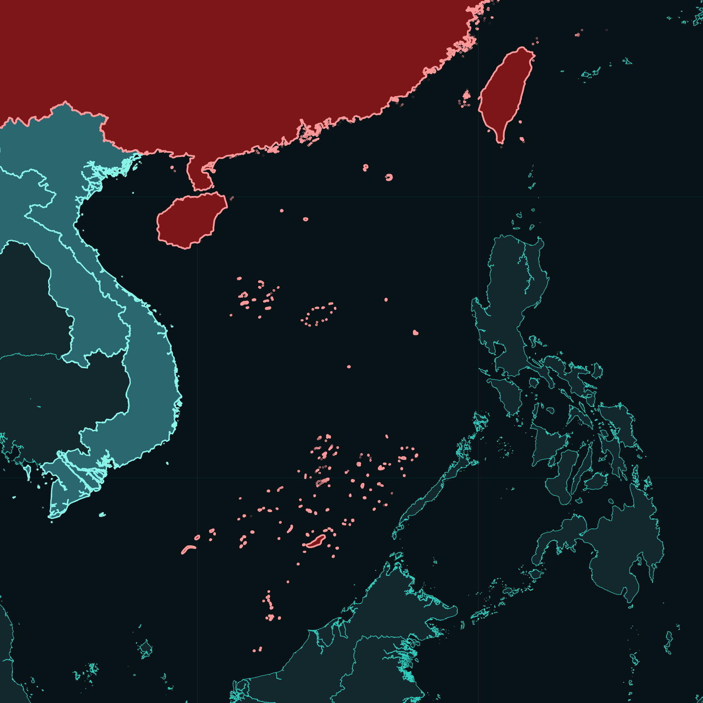
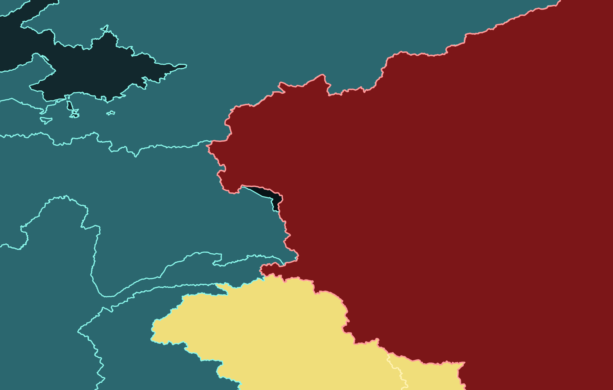

<p align="center">
  
</p>

# cnmaps-data

`cnmaps-data` 是 `cnmaps` 的官方数据包，用于承载与 `cnmaps` 配套的边界数据、索引数据和样例数据。

它的设计目标有三点：

- 把 `cnmaps` 的功能代码与大体积数据解耦
- 让 `cnmaps` 主包可以更轻、更高频地迭代
- 为第三方数据包提供可复用的协议参考

## 包含的数据

当前 `cnmaps-data` 内置三类数据集：

  - 行政区边界数据
  - 索引库：`cnmaps_data/data/index/administrative.db`
  - 数据根目录：`cnmaps_data/data/datasets/administrative/`
  - 当前包含：
    - `amap`：**高德**来源的中国省 / 市 / 县行政区边界（包内目录与索引字段 `source = 高德`；出处见「[数据来源](#数据来源)」）
    - `cn-neighbors`：基于中国官方口径边界与世界银行国界数据派生的邻国国家级边界（目录独立，但 SQLite 中 `source = 世界银行`）
    - `world-countries`：除中国及 `cn-neighbors` 外的其他世界国家级边界（目录独立，但 SQLite 中 `source = 世界银行`）
- 地理边界数据
  - 数据根目录：`cnmaps_data/data/datasets/geography/`
- 样例数据
  - 数据根目录：`cnmaps_data/data/datasets/sample/`

关于 `cn-neighbors`：

- 它只提供“国”一级边界，不下探到邻国的省州级行政区。
- 它的几何是基于 `cnmaps-data` 中的中国边界，结合外部世界边界源数据裁剪/派生得到。
- 这是一套带明确口径说明的派生数据，不应与国际通行的中立边界数据混淆。
- 在 SQLite 中，它与 `world-countries` 一样统一标记为 `source = 世界银行`，二者的区别主要通过 `path` 目录前缀体现。

关于 `world-countries`：

- 它只提供“国”一级边界。
- 当前数据库中的国家名称统一使用中文名，GeoJSON 中同时保留 `name_en` 英文名。
- 它不包含中国，也不包含已经在 `cn-neighbors` 中单独处理的邻国。
- 它也不会以国家级记录的形式单独收录台湾、香港、澳门。
- 它在写出前会统一扣除 `cnmaps-data` 当前中国边界所覆盖的几何区域，以避免与中国口径边界产生重叠。
- 中文名映射表只是维护辅助资料；最终名称仍直接写入 SQLite 和 GeoJSON 产物中。
- 除主权国家外，它现在也纳入了一批带 `iso3` 的海外领地/属地记录，例如格陵兰。
- 与 `cn-neighbors` 一样，它在 SQLite 中统一标记为 `source = 世界银行`。

关于 `iso3`：

- `ADMINISTRATIVE` 表现在正式包含 `iso3` 列。
- 国外国家 / 地区级记录写入各自的 `ISO3` 或自定义组合码，例如 `PSE`、`IND-PAK-JK`。
- 中国行政区记录默认写作 `CHN`。
- 香港特别行政区相关记录写作 `HKG`，澳门特别行政区相关记录写作 `MAC`。
- 台湾相关记录仍统一写作 `CHN`。

## 数据来源

行政区边界所依据的公开数据出处如下。仓库内几何与属性可能经过裁剪、拓扑处理、与中国边界做几何扣除或与中文名映射合并，以包内实际文件为准。

- **中国省 / 市 / 县**：原始数据来自 **高德（Amap）**。独立对照与学术引用可使用 [GaryBikini/ChinaAdminDivisonSHP](https://github.com/GaryBikini/ChinaAdminDivisonSHP) **v2.0**（2021），Zenodo DOI [10.5281/zenodo.4167299](https://doi.org/10.5281/zenodo.4167299)。
- **国外国家与地区（国界级）**：**World Bank Official Boundaries - Admin 0**（[World Bank Data Catalog](https://datacatalog.worldbank.org/search/dataset/0038272/world-bank-official-boundaries)），用于提供全球国家级边界、领地及争议区几何。仓库内的 `cn-neighbors` 与 `world-countries` 会在此基础上继续执行邻国吸附、中国口径扣除、争议区分类整理和中文名称回写。

`cn-neighbors` 与 `world-countries` 的中国一侧几何与 `amap` 一致，国外一侧基于上述世界国界数据派生，详见各小节说明。

## 边界处理效果

下面几张图用于展示当前数据包对中国周边边界、争议区以及海上方向的处理效果：

- 中国使用暗红色表示
- 周边国家与地区使用蓝绿色表示
- 单独保留的争议地区使用浅黄色表示

### 总览

<p align="center">
  
</p>

### 中印边界与克什米尔争议区

<p align="center">
  
</p>

### 南海方向

<p align="center">
  
</p>

### 中国-塔吉克斯坦边界

<p align="center">
  
</p>

关于中国和塔吉克斯坦之间出现的空隙，需要额外说明：

- 中国和塔吉克斯坦之间长期存在未定国界问题。
- 世界银行及其他国际版本边界数据在中塔边界处采用的口径，与中国大陆正规地图的未定国界口径并不一致。
- 中国大陆当前主流正规地图在这一段边界上的口径，相比国际版本更小；这和其他“自己主张更大范围”的争议区不同，属于“当前中国大陆公开审图口径反而更吃亏”的情况。
- 天地图、高德、百度等带审图号的主流地图产品，目前在这里普遍都采用这一更小的版本。
- 因此，当 `amap` 的中国边界与世界银行的外国边界在中塔边境直接拼接时，会留下图中可见的一片空白区域。
- 基于最小改动原则，`cnmaps-data` 目前对这一处仅做说明，不做额外人工填补或再分配处理。

## 与 cnmaps 的关系

`cnmaps` 运行时会优先发现并使用已安装的数据 provider。对官方数据包来说，`cnmaps-data` 会通过 Python entry point 暴露 provider，`cnmaps` 安装后默认会把它作为依赖一起安装。

也就是说，正常情况下用户只需要：

```bash
pip install cnmaps
```

就会同时得到：

- `cnmaps`
- `cnmaps-data`

## 数据发现机制

`cnmaps` 当前按以下优先级查找数据源：

1. 已安装包里注册的 `cnmaps.data_providers` entry point
2. 官方包 `cnmaps_data.provider`

因此，第三方数据包如果想兼容 `cnmaps`，推荐使用 entry point 方式提供自己的 provider。当前 `cnmaps 2.x` 不再依赖内置旧数据目录，也不再以同级源码目录作为正式运行时发现路径。

## 对第三方开发者

如果你希望开发自己的 `cnmaps` 数据包，请优先阅读：

- [开发者手册](docs/developer-guide.md)
- [国家名称与 ISO3 映射表](docs/country-name-map.md)
- [数据集覆盖范围索引](docs/dataset-index.md)

这份文档里会说明：

- provider 需要实现什么接口
- `manifest.json` 需要有哪些字段
- SQLite 索引库需要满足什么规则
- GeoJSON 文件需要满足什么格式
- 如何用检查脚本验证你的数据包

## 本地开发

在仓库根目录可以直接构建：

```bash
python -m build
```

更新索引库后，若需同步更新文档中的省 / 市 / 县与国外名称列表，可执行：

```bash
python scripts/generate_dataset_index_docs.py
```

如果需要重建 `cn-neighbors` 数据，可使用：

```bash
python scripts/generate_cn_neighbors.py --world-shp /path/to/WB_GAD_ADM0_complete.shp
```

如果需要生成其他世界国家级边界，可使用：

```bash
python scripts/generate_world_countries.py --world-shp /path/to/WB_GAD_ADM0_complete.shp
```

这个脚本会在输出 `world-countries` 前，先对每个国家执行一次基于中国边界的几何扣除。

如果需要把外部映射表中的中文名批量回写到 SQLite/GeoJSON，可使用：

```bash
python scripts/update_country_names.py
```

如果需要在修改数据库结构或生成逻辑后，重新生成国外名称索引页，可执行：

```bash
python scripts/generate_dataset_index_docs.py
```

构建结果会包含：

- `sdist`
- `wheel`

## 数据检查

本仓库自带检查脚本，安装后可以直接执行：

```bash
cnmaps-data-check
```

或者：

```bash
python -m cnmaps_data.checker
```

它会检查：

- `manifest.json` 是否完整
- 数据目录是否存在
- 行政区索引库 schema 是否符合要求
- 索引中声明的 GeoJSON 文件是否真实存在
- GeoJSON 的基本结构是否满足 `cnmaps` 当前读取规则

如果要检查某个自定义目录，也可以显式传入：

```bash
python -m cnmaps_data.checker /path/to/your-data-package/cnmaps_data
```

如果你的命令行里还没有直接找到 `cnmaps-data-check`，通常是因为当前 shell 没有激活对应的 Python 环境；这种情况下直接使用 `python -m cnmaps_data.checker ...` 即可。

## 发布

本仓库已配置 GitHub Actions + PyPI Trusted Publishing。发布流程通常为：

1. 更新版本号
2. 推送代码
3. 在 GitHub 创建 Release
4. Actions 自动构建并发布到 PyPI

## 相关文档

- [开发者手册](docs/developer-guide.md)
- [数据集覆盖范围索引](docs/dataset-index.md)（省 / 市 / 县与国外名称列表，由索引库生成）
- [国家名称与 ISO3 映射表](docs/country-name-map.md)
- [更新日志](CHANGELOG.md)
